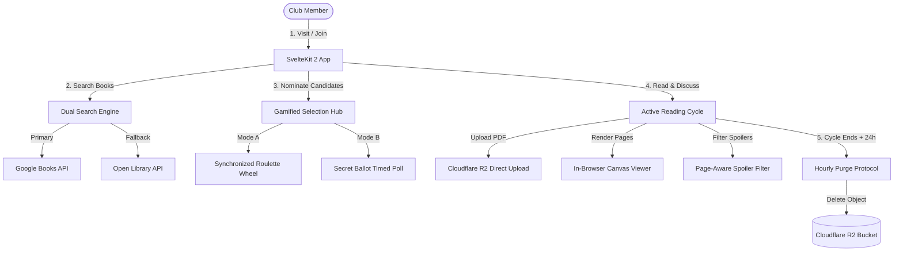

# The Book Club 📚

[](LICENSE)
[](https://kit.svelte.dev/)
[](https://svelte.dev/)
[](https://www.typescriptlang.org/)
[](https://biomejs.dev/)
[](https://vitest.dev/)
[](#zero-cost-infrastructure-architecture)

> A modern, gamified open-source book club platform built with SvelteKit 2, Svelte 5, and a tactile, flat geometric Kahoot-style design system. Designed to run permanently on free-tier cloud infrastructure with zero operational costs.

---

## Architecture & Philosophy

The Book Club replaces bloated reading spreadsheets and high-cost hosted platforms with an interactive, tactile web application. Every architectural decision conforms to two fundamental design principles:

1. **Tactile Geometric Design System:** Chunky 3px solid borders, vibrant saturated color blocks (Red, Blue, Yellow, Green, Purple), physical 3D button press depressions, and zero blurred shadows or gradients.
2. **Zero-Cost Cloud Infrastructure:** Presigned client-to-storage uploads, client-side data exports, canvas PDF rendering, and an automatic 24-hour post-deadline PDF purge protocol to operate strictly within free cloud tier limits.



---

## Core Features

### 🔍 Dual-Engine Book Discovery
* **Multi-Engine Fallback:** Queries Google Books for metadata, high-resolution covers, and purchase links. Automatically falls back to Open Library when rate limits or zero-result conditions occur.
* **Metadata Normalization:** Delivers unified book payloads with page counts, authors, ISBNs, and store links.

### 🎲 Synchronized Roulette & Timed Secret Ballots
* **Roulette Wheel:** Animated HTML5 canvas/SVG segmented wheel with deterministic server-side random seeds and cubic-bezier easing physics.
* **Timed Secret Ballot:** Configurable duration countdowns (1h, 6h, 12h, 24h, custom). Member votes remain masked until the ballot is cast or the timer expires.

### 📄 In-Browser Canvas PDF Reader & 24h Purge Protocol
* **Zero-Memory Streaming:** Direct presigned uploads to Cloudflare R2 without proxying files through server memory.
* **Canvas Document Viewer:** Embedded, responsive PDF viewer with page navigation, zoom scaling, and page jumps.
* **Automatic Storage Purge:** Enforces a 24-hour post-deadline purge window, deleting temporary PDF documents automatically to keep storage usage well under free tier allowances.

### 💬 Anti-Spoiler Discussion Feed & Reading Progress
* **Page-Aware Blurring:** Messages referencing pages beyond a member's recorded reading progress are automatically blurred with a click-to-reveal toggle.
* **Social Reading Race:** Real-time horizontal track visualizer mapping member avatars (Gravatar MD5) to reading percentages.

### ⭐ Multi-Criteria Reviews & Community History
* **Standard & Deep Rubrics:** 5-star aggregate scoring alongside 5-dimension rubric evaluations (*Plot, Characters, Pacing, Writing, Emotion*).
* **Archive Showcase:** Completed reading cycles are preserved in read-only history archives with full review summaries.

### 🛠️ Client-Side Social & Export Tools
* **Shareable Social Cards:** Generates PNG reading achievement cards in browser memory.
* **Data Portability:** Instant client-side CSV and JSON export of complete club history.
* **Club Invite QR Codes:** Dynamic client-rendered QR codes for fast mobile onboarding.

### 🌐 Bilingual Localization (i18n) & WCAG Accessibility
* **Paraglide JS Architecture:** Compile-time type-safe translations in English (`en`) and Spanish (`es`).
* **Auto-Detection & Toggle:** Inspects browser `Accept-Language` headers with immediate tactile header switch overrides (`EN | ES`).
* **Accessibility:** Full keyboard Tab/Enter navigability, high-contrast color ratios across all three themes (`classic`, `midnight`, `bookshelf`).

---

## Zero-Cost Infrastructure Architecture

| Service Layer | Provider | Free Tier Boundaries | Purpose in The Book Club |
| :--- | :--- | :--- | :--- |
| **Application Hosting** | Cloudflare Pages / Vercel | Unlimited bandwidth, 100k req/day | SSR SvelteKit web application and edge API routes. |
| **PDF Document Storage** | Cloudflare R2 | 10 GB storage, 10M reads, 1M writes | Zero-egress PDF file hosting with presigned direct uploads. |
| **Book Discovery** | Google Books + Open Library | Free public API tier | Metadata, author information, and cover imagery. |
| **Avatars** | Gravatar CDN | Free global service | Privacy-focused dynamic profile pictures via email hash. |
| **Lifecycle Purge** | Cloudflare / Vercel Cron | Free scheduled triggers | Hourly sweep triggering the 24-hour post-deadline PDF deletion. |

---

## Quickstart & Local Development

### Prerequisites
* **Node.js**: `v22.12.0` or `v24.x` (LTS/Current)
* **npm**: `v10.x` or newer

### 1. Clone & Install
```bash
git clone https://github.com/openrise-hub/thebooklub.git
cd thebooklub
npm install --ignore-scripts
```

### 2. Environment Setup
```bash
cp .env.example .env
```
*(Development defaults in `.env.example` allow immediate local testing without third-party accounts).*

### 3. Start Development Server
```bash
npm run dev
```
Open [http://localhost:5173](http://localhost:5173) in your browser.

---

## Code Quality & Verification Suite

The repository enforces strict linting, type-checking, and test validation:

```bash
# Execute Biome formatter and linter check
npm run lint

# Auto-fix formatting and linting issues
npm run lint:fix

# Run SvelteKit synchronization and TypeScript type checking
npm run check

# Run Vitest automated test suite (57 test files, 447+ tests)
npm run test

# Compile production bundle verification
npm run build
```

---

## Deployment Guide

### Cloudflare Pages (Recommended)
1. Link your GitHub repository in the **Cloudflare Dashboard > Workers & Pages**.
2. Set Build Command: `npm run build`
3. Set Output Directory: `.svelte-kit/cloudflare`
4. Configure environment variables from [`.env.example`](.env.example).

### Vercel
1. Import repository in **Vercel Dashboard**.
2. Framework is automatically detected as `SvelteKit`.
3. Scheduled purge cron is automatically registered via [`vercel.json`](vercel.json).

### Cloudflare R2 Bucket CORS Setup
To allow in-browser canvas PDF rendering with range requests, configure CORS on your R2 bucket:
```json
[
  {
    "AllowedOrigins": ["*"],
    "AllowedMethods": ["GET", "HEAD", "PUT"],
    "AllowedHeaders": ["Content-Type", "Content-Length", "Range", "Authorization", "x-amz-date", "x-amz-content-sha256"],
    "ExposeHeaders": ["ETag", "Content-Type", "Content-Length", "Content-Range", "Accept-Ranges"],
    "MaxAgeSeconds": 3600
  }
]
```

---

## Project Structure

```
the-book-club/
├── .github/
│   ├── workflows/
│   │   └── ci.yml                 # Automated CI verification pipeline
│   ├── ISSUE_TEMPLATE/            # Defect & feature templates
│   └── PULL_REQUEST_TEMPLATE.md   # Standard pull request checklist
├── messages/                      # Paraglide JS translation catalogs
│   ├── en.json                    # English message catalog
│   └── es.json                    # Spanish message catalog
├── src/
│   ├── app.css                    # Tactile geometric design tokens & theme palettes
│   ├── app.html                   # Base HTML document with theme pre-loader
│   ├── hooks.server.ts            # Auth session verification & i18n locale detector
│   ├── lib/
│   │   ├── components/            # Reusable chunky components (Roulette, RaceTrack, etc.)
│   │   ├── constants/             # Centralized constant thresholds (zero magic numbers)
│   │   ├── server/                # Server storage, purge worker, and security utilities
│   │   └── utils/                 # QR codes, Gravatar, social card & export generators
│   └── routes/                    # SvelteKit application pages and API endpoints
├── .env.example                   # Environment configuration reference
├── biome.json                     # Biome linter and formatting rules
├── lefthook.yml                   # Pre-commit git hook configuration
├── package.json                   # Pinned dependency definitions
├── svelte.config.js               # SvelteKit adapter configuration
└── tsconfig.json                  # Strict TypeScript configuration
```

---

## Contributing & Community

Contributions are welcome! Please review our community guidelines:
* [Contributing Guidelines](CONTRIBUTING.md)
* [Code of Conduct](CODE_OF_CONDUCT.md)
* [Security Policy](SECURITY.md)

---

## License

This project is licensed under the **GNU General Public License v3.0 (GPLv3)**. See [`LICENSE`](LICENSE) for complete terms.